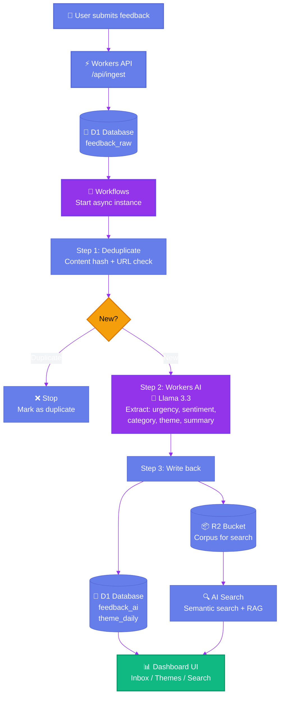

# Challenge 1: Async Reliability — Workflow Pipeline Diagram

This diagram shows how Cloudflare Workflows handles async AI processing to keep the UI fast while ensuring reliability.

## Mermaid Code (for https://mermaid.live)

## How to use in video presentation

### Option 1: Mermaid Live (Recommended)
1. Go to https://mermaid.live
2. Paste the code above into the left editor
3. Click "Hide Editor" to show diagram only
4. Use browser zoom (Cmd/Ctrl +) to enlarge
5. Press F11 for full-screen mode

### Option 2: GitHub Markdown Preview
1. Open this file in GitHub
2. The diagram will render automatically
3. Take a screenshot or screenshare

### Option 3: VS Code with Mermaid extension
1. Install "Markdown Preview Mermaid Support" extension
2. Open this file
3. Press Cmd+Shift+V (Mac) or Ctrl+Shift+V (Windows)
4. View rendered diagram

---

## Talking points while showing this diagram (60 seconds)

**0:00–0:10 — Problem statement**
"Challenge one: AI can be slow or flaky. I didn't want the UI to wait on model inference."

**0:10–0:25 — Solution overview**
"Solution: I used Cloudflare Workflows to run analysis asynchronously. The flow is: user submits feedback, it goes into D1 immediately, then a Workflow instance starts in the background."

**0:25–0:45 — Three-step pipeline**
(Point at Step 1 → 2 → 3)
"The workflow has three steps: Step 1 deduplicates using content hash. Step 2 calls Workers AI to extract urgency, sentiment, category, and theme. Step 3 writes results back to D1 and populates the R2 corpus for semantic search."

**0:45–0:60 — Business value**
(Point at Dashboard)
"The user gets a fast UI because ingestion is instant. And the pipeline stays reliable with retries—so even if AI fails temporarily, the workflow will complete eventually."

---

## Key visual elements in the diagram

| Element | Color | Represents |
|---------|-------|------------|
| Purple (🔄 Workflows, 🤖 AI) | #9333ea | Async/AI processing layer |
| Blue (⚡ Workers, 💾 D1) | #667eea | Core Cloudflare infrastructure |
| Green (📊 Dashboard) | #10b981 | User-facing result |
| Orange (Decision diamond) | #f59e0b | Business logic branching |

This color scheme ensures:
- High contrast for screen recording
- Clear visual hierarchy (async = purple, sync = blue)
- Professional appearance matching Cloudflare brand
